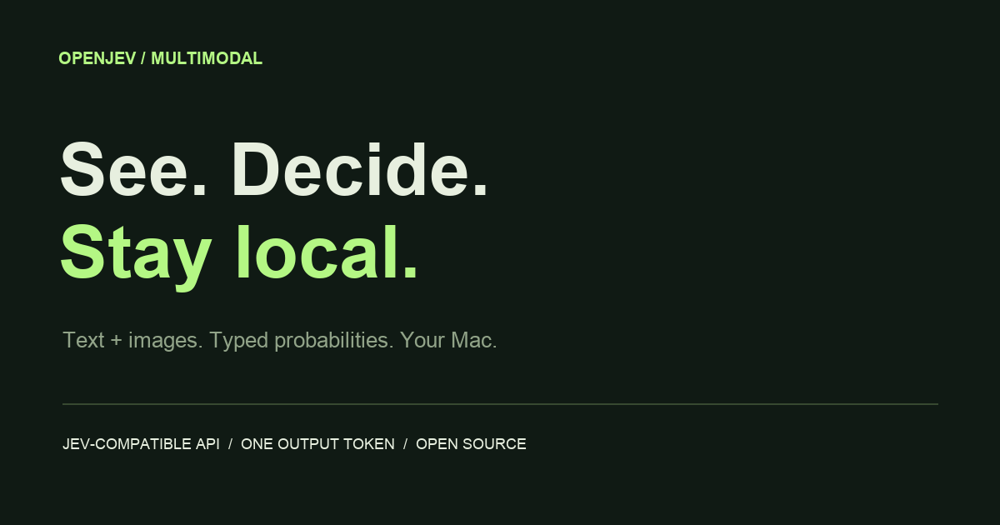
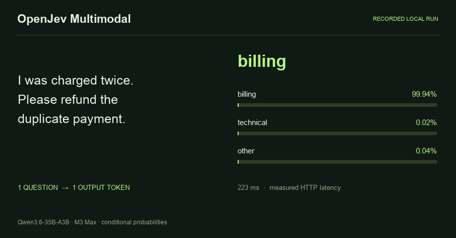
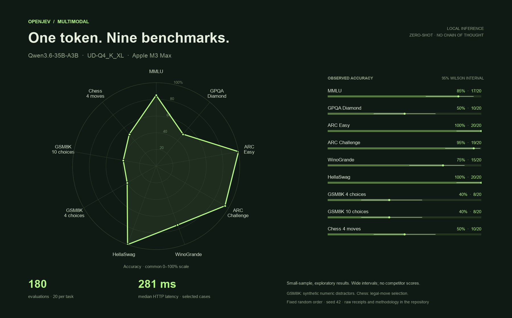

<p align="center"></p>

<p align="center">
  <a href="https://hand-in.github.io/openjev-multimodal/">Documentation</a> ·
  <a href="https://hand-in.github.io/openjev-multimodal/zh/">中文文档</a> ·
  <a href="README.zh-CN.md">中文 README</a> ·
  <a href="https://hand-in.github.io/openjev-multimodal/benchmarks">Benchmarks</a>
</p>

# OpenJev Multimodal

**Text and images → typed decisions. One output token per question. Runs on your Mac.**

A local, open-source **Jev-compatible SystemOne API** powered by Qwen and llama.cpp / Metal. Route messages, interpret screenshots, score rubrics or choose the next action with complete probability distributions.

- **Three primitives:** Noul (yes probability), Choice (selection + distribution), Score (expected rubric index).
- **Native vision:** PNG/JPEG/WebP, multimodal chat and multiple sampled frames.
- **One-token readout:** no generated reasoning or token-by-token JSON output.
- **255 Choice options:** verified single-token labels and complete probability checks.
- **Local inference:** state and images stay on the machine. No paid inference API required.
- **Controlled resources:** one inference slot and four CPU threads by default.

Independent implementation; not affiliated with TypeSafe and not its proprietary Jev weights. Probabilities are conditioned on your options, not calibrated correctness guarantees.

## Run locally

Apple Silicon, Python 3.11+, llama.cpp b9670 or newer with post-sampling probabilities:

```bash
brew install uv llama.cpp
git clone https://github.com/Hand-In/openjev-multimodal.git
cd openjev-multimodal
uv sync --frozen
uv run openjev serve
```

Open **http://localhost:8000/playground** for live text/image input or **http://localhost:8000/docs** for the API. The first run downloads pinned weights; later runs use cache. Ctrl+C stops the API and its backend.

| Profile | Model | Quantization | Use |
| --- | --- | --- | --- |
| `fast` | Qwen3.5-0.8B | Q4_K_M | Small footprint, simple decisions |
| `balanced` (default) | Qwen3.5-4B | Q4_K_M | Everyday text and vision |
| `quality` | Qwen3.6-35B-A3B | UD-Q4_K_XL | Larger Macs, stronger knowledge |
| `max` | Qwen3.8-27B | UD-Q4_K_XL | The strongest judgment |

```bash
uv run openjev serve --profile quality  # one profile at a time
uv run openjev doctor
```

Quality weights are about 23.3 GB and max weights 17.6 GB, each plus a 0.9 GB projector. For sub-second `max` decisions on a repeated state, build the [patched llama.cpp](https://hand-in.github.io/openjev-multimodal/models#max-qwen3-8-27b) once with `scripts/build-llama.sh`; `serve` then uses it. Slow downloads? `--source modelscope` fetches the same verified files from ModelScope. `--backend` chooses the inference backend: llama.cpp is built in, and [plugin packages](https://hand-in.github.io/openjev-multimodal/design#backends) can add others. Published measurements use an M3 Max with 128 GB memory; smaller-machine minimums were not benchmarked.

## A decision is an API call

```bash
curl http://127.0.0.1:8000/v1/systemone \
  -H 'Content-Type: application/json' \
  -d '{
    "model": "jev-latest",
    "state": "I was charged twice. Please refund the duplicate.",
    "questions": {
      "team": {
        "type": "choice",
        "instructions": "Which team should handle this?",
        "criteria": {
          "billing": "Payments and refunds",
          "technical": "Software bugs"
        }
      }
    }
  }'
```

Read `answers.team.choice` and `answers.team.probabilities`. Add an `images` array of inline data URLs for vision. Structured JSON state, instructions and criteria are preserved. [Full API →](https://hand-in.github.io/openjev-multimodal/api)

## Real local responses



A **replay of actual local API responses**, with measured latency. The checkout image is an original synthetic fixture. The website replays recordings; the localhost playground runs live inference. [Recorded JSON](benchmarks/demo.json) · [Image example](examples/image_decision.py).

## Tetris: decisions under time pressure

[](https://hand-in.github.io/openjev-multimodal/tetris)

Four local models play Tetris through the API. Code simulates every legal two-piece plan and presses the keys; **one Choice token picks the plan**. Random picks among the same plans clear 14.3 lines per game. Qwen3.8-27B clears 38.2 and decides in 0.73 s, with the rules cached as an unchanging state. [Demo page](https://hand-in.github.io/openjev-multimodal/tetris) · [Play in the browser](https://hand-in.github.io/openjev-multimodal/demos/tetris/web/) · [Test report](examples/tetris/report/README.md) · [Code](examples/tetris).

## Use it from an agent

```bash
npx openskills install Hand-In/openjev-multimodal/skills/openjev-multimodal -g -y
```

The [openjev-multimodal skill](skills/openjev-multimodal) teaches Claude Code, Codex and any `AGENTS.md` agent to start and check the service, design Noul, Choice and Score questions, size images for the vision encoder, and read probabilities and latency. From a clone: `npm run skill:install`.

## Small-sample benchmark



**Only our API is plotted.** Qwen3.6-35B-A3B UD-Q4_K_XL · llama.cpp b9670 · M3 Max · zero-shot · one output token · **20 samples/task, 180 displayed evaluations**. Median HTTP latency: **281 ms** across selected text cases.

Exploratory subset, not a leaderboard result. Wilson intervals show sampling uncertainty. GSM8K uses synthetic numeric distractors; chess measures legal-move selection. A larger run was stopped to limit load; all 886 completed receipts remain archived. The chart selects the first 20 in each task's random order, without score-based filtering.

[Methodology](https://hand-in.github.io/openjev-multimodal/benchmarks) · [Summary + IDs](benchmarks/quality/summary.json) · [All receipts](benchmarks/quality/decisions.jsonl) · [SVG chart](assets/benchmark.svg).

```bash
# Quality server running: small, serial, with rest between calls.
uv run --group bench python scripts/benchmark.py \
  --samples 20 --cooldown 0.25 --output benchmarks/local

# Re-render recorded results without inference.
uv run --group bench python scripts/render_benchmark.py
```

## Design and operations

Options map to verified single-token labels. A uniform logit bias brings them into the probability list; normalization cancels the shared bias. Every candidate must be present. The API computes typed answers from the complete distribution. Input prefill, image encoding, model size and cache still determine latency; every response reports its server time. [How it works →](https://hand-in.github.io/openjev-multimodal/design) · [Latency →](https://hand-in.github.io/openjev-multimodal/performance)

- Localhost binding by default; `OPENJEV_API_KEY` enables Bearer auth on `/v1/*`.
- `/health` checks the backend; `/health/live` checks the process; `/v1/limits` exposes limits.
- Bounded requests, queue, image decoding and deadlines; explicit backend errors.
- No remote image fetching or request-controlled file reads.
- Audio/native video unsupported; sampled frames can be supplied as images.
- `--connect` attaches to an existing compatible llama.cpp server.
- GitHub Pages hosts **static documentation**, not the inference API.

## References and license

Inspired by [openjev-sglang](https://github.com/ekzhang/openjev-sglang), [AlexWortega/openjev](https://huggingface.co/AlexWortega/openjev), [HN](https://news.ycombinator.com/item?id=49752041) and [TypeSafe's API](https://docs.typesafe.ai/api). Published NLI checkpoint scores are not our scores. One synthetic online Jev request verified the common wire shape; it is not part of the benchmark.

[MIT](LICENSE) for original code. Model weights and datasets retain their licenses. See [NOTICE](NOTICE).
