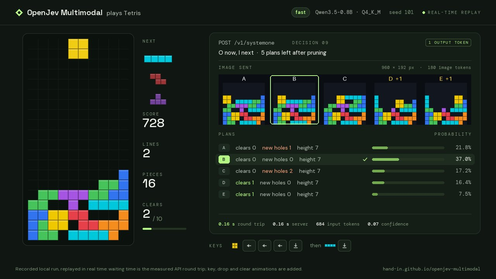
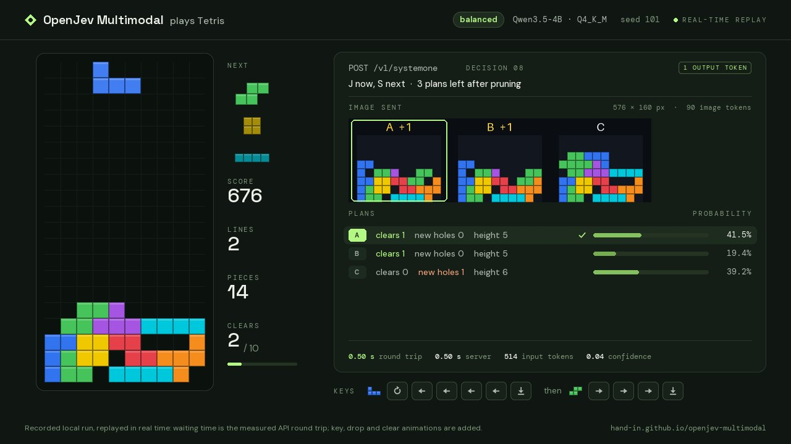
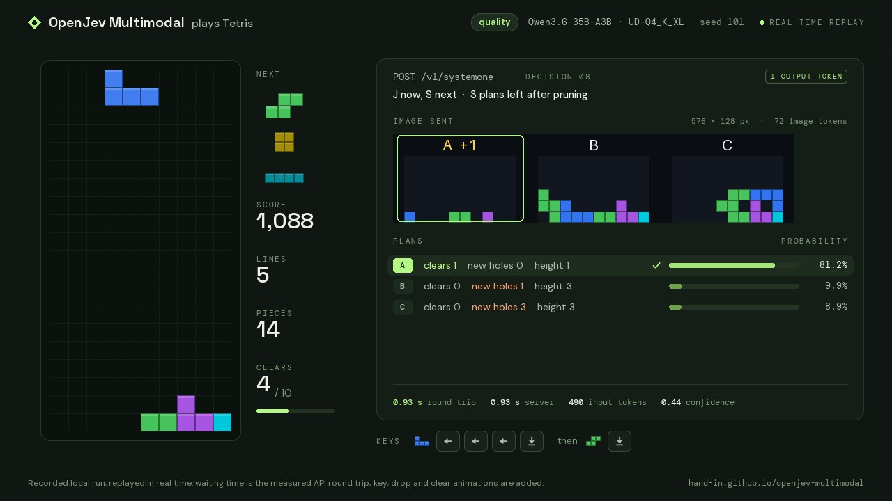
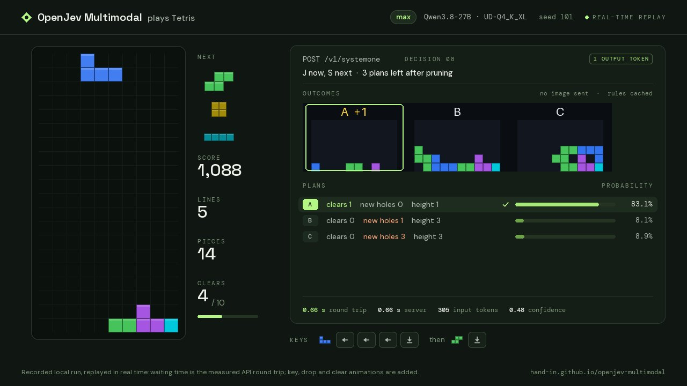
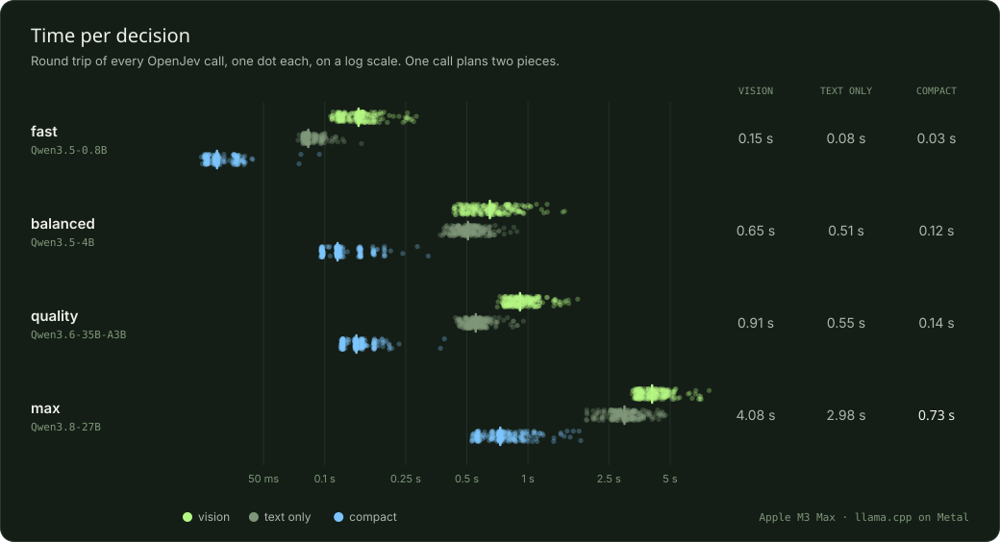
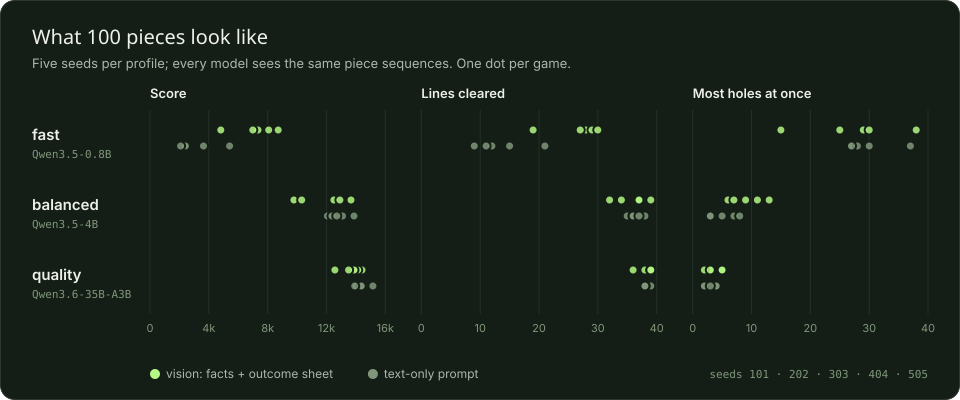
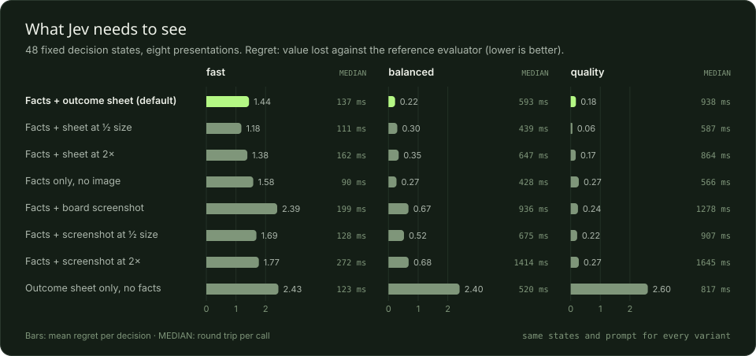

# Tetris test report

[Visual report](https://jev-skills.github.io/openjev-multimodal/demos/tetris/report/) · [Play in the browser](https://jev-skills.github.io/openjev-multimodal/demos/tetris/web/) · [How the example works](../README.md) · [中文](README.zh-CN.md)

Four local Qwen models played Tetris through OpenJev Multimodal. Code lists every legal move and simulates its outcome; the model makes every choice, reading one output token per two pieces. 60 games of 100 pieces, the same five piece sequences for every model, measured 2026-09-21 on an Apple M3 Max.

- **58 / 60** games reached 10 line clears (4 models × prompts × 5 seeds · 0 illegal keys)
- **0.73 s** per decision on Qwen3.8-27B (median of 234 compact calls · the same prompt uncached: 1.93 s)
- **38.2** lines per game, max · compact (random picks on the same plans: 14.3)
- **15,262** best score after 100 pieces (quality · compact · seed 202)

## Watch each model play

Seed 101, from the first piece to the tenth line clear. Waiting time is the measured round trip of each call.

| [](videos/fast.mp4)<br>**fast · Qwen3.5-0.8B**<br>vision · goal after 56 pieces · 0.14 s per call | [](videos/balanced.mp4)<br>**balanced · Qwen3.5-4B**<br>vision · goal after 30 pieces · 0.51 s per call | [](videos/quality.mp4)<br>**quality · Qwen3.6-35B-A3B**<br>vision · goal after 32 pieces · 0.92 s per call | [](videos/max.mp4)<br>**max · Qwen3.8-27B**<br>compact · goal after 32 pieces · 0.66 s per call |
|---|---|---|---|

## Results after 100 pieces

| Profile | Prompt | 10 clears | Hole-free goal | Topped out | Lines | Score (mean / best) | Most holes | Call median | Agreement |
|---|---|---|---|---|---|---|---|---|---|
| fast · Qwen3.5-0.8B | vision | 5 / 5 | 0 / 5 | 1 / 5 | 26.6 | 7,186 / 8,714 | 29 | 0.15 s | 42% |
| fast · Qwen3.5-0.8B | text only | 4 / 5 | 0 / 5 | 5 / 5 | 13.6 | 3,199 / 5,410 | 28 | 0.08 s | 28% |
| fast · Qwen3.5-0.8B | compact | 4 / 5 | 0 / 5 | 5 / 5 | 17.4 | 4,222 / 5,848 | 28 | 0.03 s | 39% |
| balanced · Qwen3.5-4B | vision | 5 / 5 | 0 / 5 | 0 / 5 | 35.8 | 11,837 / 13,668 | 9 | 0.65 s | 73% |
| balanced · Qwen3.5-4B | text only | 5 / 5 | 1 / 5 | 0 / 5 | 36.4 | 12,818 / 13,868 | 5 | 0.51 s | 72% |
| balanced · Qwen3.5-4B | compact | 5 / 5 | 1 / 5 | 0 / 5 | 33.0 | 10,590 / 11,446 | 10 | 0.12 s | 57% |
| quality · Qwen3.6-35B-A3B | vision | 5 / 5 | 3 / 5 | 0 / 5 | 38.2 | 13,696 / 14,416 | 3 | 0.91 s | 84% |
| quality · Qwen3.6-35B-A3B | text only | 5 / 5 | 4 / 5 | 0 / 5 | 38.2 | 14,384 / 15,156 | 3 | 0.55 s | 82% |
| quality · Qwen3.6-35B-A3B | compact | 5 / 5 | 5 / 5 | 0 / 5 | 38.2 | 14,074 / 15,262 | 2 | 0.14 s | 79% |
| max · Qwen3.8-27B | vision | 5 / 5 | 3 / 5 | 0 / 5 | 38.4 | 13,422 / 13,792 | 2 | 4.08 s | 85% |
| max · Qwen3.8-27B | text only | 5 / 5 | 4 / 5 | 0 / 5 | 37.8 | 13,400 / 14,446 | 3 | 2.98 s | 80% |
| max · Qwen3.8-27B | compact | 5 / 5 | 4 / 5 | 0 / 5 | 38.2 | 13,243 / 13,778 | 2 | 0.73 s | 81% |

Five games per row, seeds 101–505. Most holes is the median over games; lines are means. Agreement compares each non-forced decision with a reference evaluator (Yiyuan Lee's tuned weights) that never influences a move.

## Without a model

The same games with the model replaced by a fixed rule, on the same pruned plans. Pruning removes only plans that another plan matches or beats on every fact; what remains still has to be chosen.

| Policy | 10 clears | Topped out | Lines | Score (mean / best) | Most holes |
|---|---|---|---|---|---|
| Random pick | 73 / 100 | 90 / 100 | 14.3 | 3,538 / 9,492 | 31 |
| Always the first plan | 3 / 5 | 4 / 5 | 16.0 | 4,188 / 7,744 | 27 |
| Reference evaluator | 5 / 5 | 0 / 5 | 37.8 | 13,285 / 13,882 | 2 |

Random: 20 games per seed. The reference evaluator is a tuned heuristic, shown for scale; it plays no part in the model's games.

## What the runs show

- **The model makes the choices that matter.** On the same plans, random picks top out in 90 of 100 games and clear 14.3 lines. Qwen3.8-27B clears 38.2 and never tops out, level with the reference evaluator (37.8).
- **Larger models judge better.** Agreement with the reference evaluator, vision prompt: 42% · 73% · 84% · 85% for 0.8B, 4B, 35B-A3B and 27B.
- **A 27B model in well under a second.** A dense 27B model processes about 200 prompt tokens per second on this Mac, so the full compact prompt takes 1.93 s. The compact prompt sends the rules as an unchanging state, which the API keeps cached (0.83 s), and OpenJev's llama.cpp patch skips a checkpoint pass the cache never needs (0.66 s). Sixteen decisions per setup.
- **Large models need little; small ones need the picture.** With the compact prompt, quality clears 38.2 lines, hole-free in 5 of 5 games, at 0.14 s per call. The 0.8B model clears 26.6 lines with the outcome sheet and 13.6–17.4 without it.

## Charts



*Every call per profile and prompt; ticks mark the medians.*



*Score, lines cleared and most holes after 100 pieces; one dot per game.*

## How one decision works

1. **Enumerate.** Code lists every legal placement of the falling piece and of the next piece after it: usually 300–600 two-piece plans.
2. **Prune without weights.** A plan is dropped only when another plan matches or beats it on every measured fact. A median of 3 plans remain, listed left to right.
3. **Ask once.** One Choice question lists every plan with its measured result. The vision prompt adds an image of each outcome; the compact prompt keeps the rules in the cached state.
4. **Read one token.** OpenJev returns the full distribution over the plans and code presses the keys of the chosen one. A plan left alone after pruning is played without a call (215 of 2,884 decisions).

### A real decision: quality, seed 101, decision 8


*The image sent: 576 × 128 px, 72 image tokens. Tile A clears a row (+1).*

**Vision request**

```json
{
  "model": "jev-latest",
  "state": {
    "game": "Tetris well: 10 columns (0-9, left to right) x 20 rows",
    "falling": "J",
    "next": [
      "S",
      "O",
      "I"
    ],
    "lines_cleared": 5
  },
  "questions": {
    "plan": {
      "type": "choice",
      "instructions": {
        "task": "Choose the plan to play: the keys for the falling piece, then for the next piece.",
        "goal": "Clear lines and keep the well healthy for the pieces that follow.",
        "priorities": [
          "Complete rows whenever possible; more rows at once is better.",
          "Do not cover empty cells: new holes are the most expensive mistake.",
          "Keep the stack low and its surface even, so the next pieces fit."
        ],
        "fields": {
          "cols": "columns the piece occupies after the drop",
          "clears": "rows completed by the two moves",
          "new holes": "empty cells the two moves seal under blocks",
          "height": "tallest column afterwards, in rows"
        },
        "image": "The image has one tile per option, lettered like the options: the well after both pieces land. +N marks rows cleared; dark gaps under blocks are holes."
      },
      "criteria": {
        "0": "J: left left left drop → cols 0-2; then S: drop → cols 3-5. Result: clears 1, new holes 0, height 1",
        "1": "J: left drop → cols 2-4; then S: rotate-back left left left drop → cols 0-1. Result: clears 0, new holes 1, height 3",
        "2": "J: rotate rotate right right right right drop → cols 7-9; then S: right drop → cols 4-6. Result: clears 0, new holes 3, height 3"
      }
    }
  },
  "images": [
    "data:image/png;base64,iVBORw0KGgoAAAANSU… (2 KB PNG)"
  ]
}
```

**Compact request, same state**

```json
{
  "model": "jev-latest",
  "state": {
    "game": "Tetris well: 10 columns (0-9, left to right) x 20 rows",
    "task": "Choose the plan to play: where the falling piece lands, then the next piece.",
    "goal": "Clear lines and keep the well healthy for the pieces that follow.",
    "priorities": [
      "Complete rows whenever possible; more rows at once is better.",
      "Do not cover empty cells: new holes are the most expensive mistake.",
      "Keep the stack low and its surface even, so the next pieces fit."
    ],
    "fields": {
      "cols": "columns the falling piece, then the next piece, occupy after landing",
      "clears": "rows completed by the two moves",
      "new holes": "empty cells the two moves seal under blocks",
      "height": "tallest column afterwards, in rows"
    }
  },
  "questions": {
    "plan": {
      "type": "choice",
      "instructions": "Falling J, next S O I. Which plan?",
      "criteria": {
        "0": "0-2 then 3-5: clears 1, new holes 0, height 1",
        "1": "2-4 then 0-1: clears 0, new holes 1, height 3",
        "2": "7-9 then 4-6: clears 0, new holes 3, height 3"
      }
    }
  }
}
```

**Response (values rounded)**

```json
{
  "model": "jev-latest",
  "answers": {
    "plan": {
      "type": "choice",
      "choice": "0",
      "probabilities": {
        "0": 0.8122,
        "1": 0.099,
        "2": 0.0887
      },
      "confidence": 0.4421
    }
  },
  "usage": {
    "input_tokens": 490,
    "output_tokens": 1
  }
}
```

Jev put 81% on plan A, the only plan that clears a row without a new hole, in 0.93 s (490 input tokens).

**Image resolution.** Qwen's vision encoder turns each 32 × 32 px block into one token. The outcome sheet draws one board cell per 16 px patch and keeps every tile on the 32 px grid, so the server never resamples it.

## Design study

The same 48 decision states, shown to each model in 9 ways. The states come from reference games on seeds 1–4, never the benchmark seeds.



*Mean regret per presentation (lower is better) and the median call time.*

| Presentation | Input tokens | Regret · fast | Regret · balanced | Regret · quality | Regret · max |
|---|---|---|---|---|---|
| Facts + outcome sheet (default) | 492 | 1.44 | 0.22 | 0.18 | 0.24 |
| Compact: cached rules, short facts | 305 | 1.54 | 0.69 | 0.41 | 0.28 |
| Facts + sheet at ½ size | 438 | 1.18 | 0.30 | 0.06 | 0.13 |
| Facts + sheet at 2× | 642 | 1.38 | 0.35 | 0.17 | 0.24 |
| Facts only, no image | 374 | 1.58 | 0.27 | 0.27 | 0.44 |
| Facts + board screenshot | 696 | 2.39 | 0.67 | 0.24 | 0.58 |
| Facts + screenshot at ½ size | 480 | 1.69 | 0.52 | 0.22 | 0.81 |
| Facts + screenshot at 2× | 888 | 1.77 | 0.68 | 0.27 | 0.70 |
| Outcome sheet only, no facts | 410 | 2.43 | 2.40 | 2.60 | 2.52 |

## Method

- **Machine.** Apple M3 Max, 128 GB; llama.cpp on Metal (b51-91c0769, b9670) with one inference slot, an 8,192-token context and a 512-token image budget. One model at a time, no other inference running.
- **Models.** The pinned OpenJev profiles: Qwen3.5-0.8B Q4_K_M, Qwen3.5-4B Q4_K_M, Qwen3.6-35B-A3B UD-Q4_K_XL and Qwen3.8-27B UD-Q4_K_XL, each with its matching F16 vision projector.
- **Protocol.** Seeds 101–505, 100 pieces per game or until the stack tops out, the same pruning for every model. The goal counts ten line-clear events.
- **Replays.** Videos and the browser replay re-simulate the recorded keys; the Python and JavaScript engines reproduce all 60 games and 2,884 decisions exactly.
- **Limits.** Five seeds per configuration is a small sample, and agreement depends on the chosen reference. Timings are for one 16-inch MacBook Pro: the max text and vision games ran after 20 minutes of continuous load, when it processed about 125 prompt tokens per second instead of 200.

## Reproduce

```bash
scripts/build-llama.sh                        # optional: OpenJev's llama.cpp patch
uv run openjev serve --profile max --llama-server .llamacpp/llama.cpp/build/bin/llama-server
uv run python examples/tetris/play.py bench --seeds 101,202,303,404,505 --modes vision,text,compact
uv run python examples/tetris/play.py ablation --variants vision,compact,text
uv run python examples/tetris/play.py baseline   # no model needed
uv run python examples/tetris/report.py          # summary, figures, pages, replays
uv run python examples/tetris/video.py --profile max --mode compact
```

## Files in this folder

- `runs/*.json`: every decision of every game, one line per decision.
- `ablation/*.json`: the design study.
- `summary.json`: the aggregates behind this page; `replays.json`: data for the web replay; `baselines.json`: the no-model policies.
- `figures/`: SVG charts and the example image; `videos/`: one video and poster per profile.
