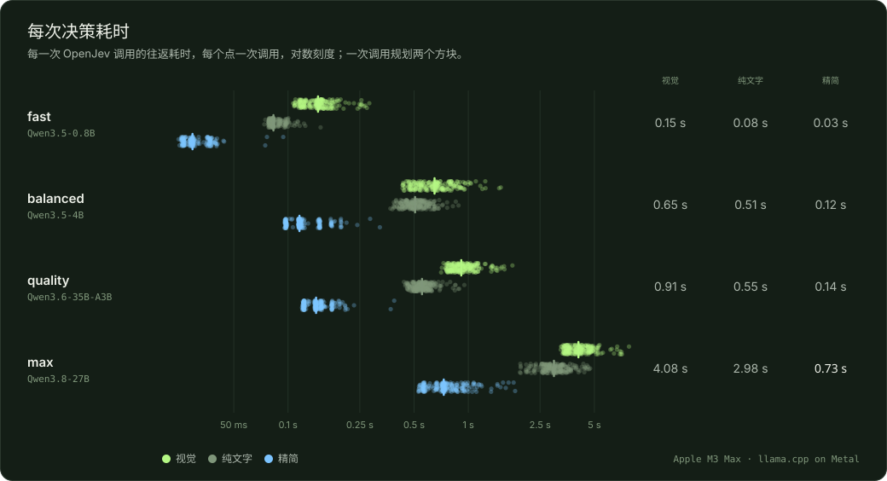
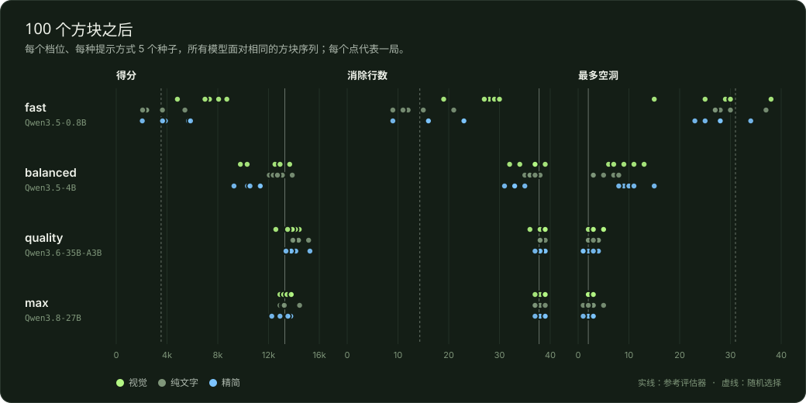
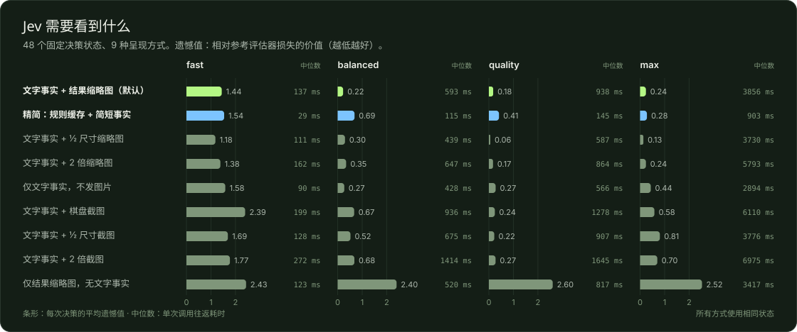

# 俄罗斯方块测试报告

[可视化报告](https://hand-in.github.io/openjev-multimodal/demos/tetris/report/) · [在浏览器中试玩](https://hand-in.github.io/openjev-multimodal/demos/tetris/web/) · [示例说明](../README.zh-CN.md) · [English](README.md)

四个本地 Qwen 模型通过 OpenJev Multimodal 玩俄罗斯方块。代码列出所有合法走法并模拟结果，每一步都由模型选择，每两个方块只读取 1 个输出 token。共 60 局、每局 100 个方块，所有模型面对相同的 5 组方块序列，测于 2026-09-21，Apple M3 Max。

- **58 / 60** 局达成 10 次消除 (4 个模型 × 提示方式 × 5 个种子 · 非法按键 0)
- **0.73 s** Qwen3.8-27B 每次决策 (精简提示 234 次调用的中位数 · 同一提示不缓存时为 1.93 秒)
- **38.2** 每局消除行数，max · 精简 (同样的方案随机选择：14.3)
- **15,262** 100 个方块后的最高分 (quality · 精简 · 种子 202)

## 观看每个模型对局

种子 101，从第一个方块播放到第 10 次消除。等待时间是每次调用实测的往返耗时。

| [](videos/fast.mp4)<br>**fast · Qwen3.5-0.8B**<br>视觉 · 56 个方块达成 · 每次调用 0.14 秒 | [](videos/balanced.mp4)<br>**balanced · Qwen3.5-4B**<br>视觉 · 30 个方块达成 · 每次调用 0.51 秒 | [](videos/quality.mp4)<br>**quality · Qwen3.6-35B-A3B**<br>视觉 · 32 个方块达成 · 每次调用 0.92 秒 | [](videos/max.mp4)<br>**max · Qwen3.8-27B**<br>精简 · 32 个方块达成 · 每次调用 0.66 秒 |
|---|---|---|---|

## 100 个方块后的结果

| 档位 | 提示方式 | 10 次消除 | 零空洞达成 | 堆满出局 | 消除行数 | 得分（平均 / 最高） | 最多空洞 | 调用中位数 | 一致率 |
|---|---|---|---|---|---|---|---|---|---|
| fast · Qwen3.5-0.8B | 视觉 | 5 / 5 | 0 / 5 | 1 / 5 | 26.6 | 7,186 / 8,714 | 29 | 0.15 s | 42% |
| fast · Qwen3.5-0.8B | 纯文字 | 4 / 5 | 0 / 5 | 5 / 5 | 13.6 | 3,199 / 5,410 | 28 | 0.08 s | 28% |
| fast · Qwen3.5-0.8B | 精简 | 4 / 5 | 0 / 5 | 5 / 5 | 17.4 | 4,222 / 5,848 | 28 | 0.03 s | 39% |
| balanced · Qwen3.5-4B | 视觉 | 5 / 5 | 0 / 5 | 0 / 5 | 35.8 | 11,837 / 13,668 | 9 | 0.65 s | 73% |
| balanced · Qwen3.5-4B | 纯文字 | 5 / 5 | 1 / 5 | 0 / 5 | 36.4 | 12,818 / 13,868 | 5 | 0.51 s | 72% |
| balanced · Qwen3.5-4B | 精简 | 5 / 5 | 1 / 5 | 0 / 5 | 33.0 | 10,590 / 11,446 | 10 | 0.12 s | 57% |
| quality · Qwen3.6-35B-A3B | 视觉 | 5 / 5 | 3 / 5 | 0 / 5 | 38.2 | 13,696 / 14,416 | 3 | 0.91 s | 84% |
| quality · Qwen3.6-35B-A3B | 纯文字 | 5 / 5 | 4 / 5 | 0 / 5 | 38.2 | 14,384 / 15,156 | 3 | 0.55 s | 82% |
| quality · Qwen3.6-35B-A3B | 精简 | 5 / 5 | 5 / 5 | 0 / 5 | 38.2 | 14,074 / 15,262 | 2 | 0.14 s | 79% |
| max · Qwen3.8-27B | 视觉 | 5 / 5 | 3 / 5 | 0 / 5 | 38.4 | 13,422 / 13,792 | 2 | 4.08 s | 85% |
| max · Qwen3.8-27B | 纯文字 | 5 / 5 | 4 / 5 | 0 / 5 | 37.8 | 13,400 / 14,446 | 3 | 2.98 s | 80% |
| max · Qwen3.8-27B | 精简 | 5 / 5 | 4 / 5 | 0 / 5 | 38.2 | 13,243 / 13,778 | 2 | 0.73 s | 81% |

每行 5 局，种子 101–505。“最多空洞”取各局中位数，消除行数取平均值。一致率把每个非强制决策与参考评估器（Yiyuan Lee 调优权重）比较；参考评估器从不参与落子。

## 没有模型会怎样

同样的对局、同样的剪枝方案，把模型换成固定规则。剪枝只去掉在每项事实上都不优于另一方案的走法，剩下的方案仍需要选择。

| 规则 | 10 次消除 | 堆满出局 | 消除行数 | 得分（平均 / 最高） | 最多空洞 |
|---|---|---|---|---|---|
| 随机选择 | 73 / 100 | 90 / 100 | 14.3 | 3,538 / 9,492 | 31 |
| 总选第一个方案 | 3 / 5 | 4 / 5 | 16.0 | 4,188 / 7,744 | 27 |
| 参考评估器 | 5 / 5 | 0 / 5 | 37.8 | 13,285 / 13,882 | 2 |

随机选择：每个种子 20 局。参考评估器是调优过的启发式规则，仅作对照，不参与模型的对局。

## 测试结论

- **关键的选择由模型做出。** 在同样的方案上，随机选择 100 局中有 90 局堆满出局，平均消除 14.3 行；Qwen3.8-27B 平均消除 38.2 行且从未出局，与参考评估器（37.8）相当。
- **模型越大，判断越好。** 视觉提示下与参考评估器的一致率：0.8B、4B、35B-A3B、27B 依次为 42%、73%、84%、85%。
- **27B 模型也能在一秒内决策。** 稠密 27B 模型在这台 Mac 上每秒约处理 200 个提示 token，完整的精简提示需 1.93 秒。精简提示把规则作为不变的 state，由 API 缓存（0.83 秒）；OpenJev 的 llama.cpp 补丁再跳过缓存用不到的检查点计算（0.66 秒）。每种配置 16 次决策。
- **大模型需要的信息很少，小模型需要图片。** 使用精简提示时，quality 平均消除 38.2 行，5 局中有 5 局零空洞达成，每次调用 0.14 秒。0.8B 模型有结果缩略图时消除 26.6 行，没有时只有 13.6–17.4 行。

## 图表



*每个档位、每种提示方式的每一次调用；短线为中位数。*



*100 个方块后的得分、消除行数与最多空洞；每个点代表一局。*

## 一次决策如何完成

1. **枚举。** 代码列出当前方块与下一个方块的所有合法落点，通常有 300–600 个两步方案。
2. **无权重剪枝。** 只有在每项实测事实上都不优于另一方案的走法才会被剔除。剪枝后中位数剩 3 个方案，从左到右排列。
3. **只问一次。** 一个 Choice 问题列出每个方案及其实测结果。视觉提示另附每个结果的图片；精简提示把规则放在缓存的 state 中。
4. **读取 1 个 token。** OpenJev 返回所有方案上的完整概率分布，代码按所选方案按键。剪枝后只剩一个方案时不调用模型（2,884 次决策中有 215 次）。

### 真实示例：quality，种子 101，第 8 次决策


*发送的图片：576 × 128 像素，72 个图像 token。A 方案消除一行（+1）。*

**视觉提示请求**

```json
{
  "model": "jev-latest",
  "state": {
    "game": "Tetris well: 10 columns (0-9, left to right) x 20 rows",
    "falling": "J",
    "next": [
      "S",
      "O",
      "I"
    ],
    "lines_cleared": 5
  },
  "questions": {
    "plan": {
      "type": "choice",
      "instructions": {
        "task": "Choose the plan to play: the keys for the falling piece, then for the next piece.",
        "goal": "Clear lines and keep the well healthy for the pieces that follow.",
        "priorities": [
          "Complete rows whenever possible; more rows at once is better.",
          "Do not cover empty cells: new holes are the most expensive mistake.",
          "Keep the stack low and its surface even, so the next pieces fit."
        ],
        "fields": {
          "cols": "columns the piece occupies after the drop",
          "clears": "rows completed by the two moves",
          "new holes": "empty cells the two moves seal under blocks",
          "height": "tallest column afterwards, in rows"
        },
        "image": "The image has one tile per option, lettered like the options: the well after both pieces land. +N marks rows cleared; dark gaps under blocks are holes."
      },
      "criteria": {
        "0": "J: left left left drop → cols 0-2; then S: drop → cols 3-5. Result: clears 1, new holes 0, height 1",
        "1": "J: left drop → cols 2-4; then S: rotate-back left left left drop → cols 0-1. Result: clears 0, new holes 1, height 3",
        "2": "J: rotate rotate right right right right drop → cols 7-9; then S: right drop → cols 4-6. Result: clears 0, new holes 3, height 3"
      }
    }
  },
  "images": [
    "data:image/png;base64,iVBORw0KGgoAAAANSU… (2 KB PNG)"
  ]
}
```

**精简提示请求（同一局面）**

```json
{
  "model": "jev-latest",
  "state": {
    "game": "Tetris well: 10 columns (0-9, left to right) x 20 rows",
    "task": "Choose the plan to play: where the falling piece lands, then the next piece.",
    "goal": "Clear lines and keep the well healthy for the pieces that follow.",
    "priorities": [
      "Complete rows whenever possible; more rows at once is better.",
      "Do not cover empty cells: new holes are the most expensive mistake.",
      "Keep the stack low and its surface even, so the next pieces fit."
    ],
    "fields": {
      "cols": "columns the falling piece, then the next piece, occupy after landing",
      "clears": "rows completed by the two moves",
      "new holes": "empty cells the two moves seal under blocks",
      "height": "tallest column afterwards, in rows"
    }
  },
  "questions": {
    "plan": {
      "type": "choice",
      "instructions": "Falling J, next S O I. Which plan?",
      "criteria": {
        "0": "0-2 then 3-5: clears 1, new holes 0, height 1",
        "1": "2-4 then 0-1: clears 0, new holes 1, height 3",
        "2": "7-9 then 4-6: clears 0, new holes 3, height 3"
      }
    }
  }
}
```

**响应（数值已取整）**

```json
{
  "model": "jev-latest",
  "answers": {
    "plan": {
      "type": "choice",
      "choice": "0",
      "probabilities": {
        "0": 0.8122,
        "1": 0.099,
        "2": 0.0887
      },
      "confidence": 0.4421
    }
  },
  "usage": {
    "input_tokens": 490,
    "output_tokens": 1
  }
}
```

Jev 把 81% 的概率给了方案 A：唯一既能消行又不产生新空洞的方案，耗时 0.93 秒（输入 490 个 token）。

**图像分辨率。** Qwen 的视觉编码器把每个 32 × 32 像素块变成 1 个 token。结果缩略图让每个棋盘格对应一个 16 像素 patch，所有小图都对齐 32 像素网格，服务端无需重新缩放。

## 设计实验

同样的 48 个决策状态，以 9 种方式分别呈现给每个模型。这些状态来自种子 1–4 上的参考对局，从未使用正式测试的种子。



*每种呈现方式的平均遗憾值（越低越好）与调用耗时中位数。*

| 呈现方式 | 输入 token | 遗憾值 · fast | 遗憾值 · balanced | 遗憾值 · quality | 遗憾值 · max |
|---|---|---|---|---|---|
| 文字事实 + 结果缩略图（默认） | 492 | 1.44 | 0.22 | 0.18 | 0.24 |
| 精简：规则缓存 + 简短事实 | 305 | 1.54 | 0.69 | 0.41 | 0.28 |
| 文字事实 + ½ 尺寸缩略图 | 438 | 1.18 | 0.30 | 0.06 | 0.13 |
| 文字事实 + 2 倍缩略图 | 642 | 1.38 | 0.35 | 0.17 | 0.24 |
| 仅文字事实，不发图片 | 374 | 1.58 | 0.27 | 0.27 | 0.44 |
| 文字事实 + 棋盘截图 | 696 | 2.39 | 0.67 | 0.24 | 0.58 |
| 文字事实 + ½ 尺寸截图 | 480 | 1.69 | 0.52 | 0.22 | 0.81 |
| 文字事实 + 2 倍截图 | 888 | 1.77 | 0.68 | 0.27 | 0.70 |
| 仅结果缩略图，无文字事实 | 410 | 2.43 | 2.40 | 2.60 | 2.52 |

## 方法

- **硬件。** Apple M3 Max，128 GB；llama.cpp（Metal，b51-91c0769、b9670），单推理槽、8,192 token 上下文、每张图 512 个图像 token 上限。同一时间只运行一个模型，没有其他推理任务。
- **模型。** OpenJev 固定版本的四个档位：Qwen3.5-0.8B Q4_K_M、Qwen3.5-4B Q4_K_M、Qwen3.6-35B-A3B UD-Q4_K_XL 与 Qwen3.8-27B UD-Q4_K_XL，各自搭配对应的 F16 视觉投影器。
- **流程。** 种子 101–505，每局 100 个方块或直到堆满出局，所有模型使用相同的剪枝规则。目标按 10 次消除事件计算。
- **回放。** 视频与网页回放按录制的按键重新模拟；Python 与 JavaScript 两套引擎逐一复现全部 60 局、2,884 次决策。
- **局限。** 每种配置只有 5 个种子，一致率取决于所选参考评估器。耗时只代表这台 16 英寸 MacBook Pro：max 的文字与视觉对局在连续运行 20 分钟后进行，当时每秒约处理 125 个提示 token，而不是 200 个。

## 复现

```bash
scripts/build-llama.sh                        # optional: OpenJev's llama.cpp patch
uv run openjev serve --profile max --llama-server .llamacpp/llama.cpp/build/bin/llama-server
uv run python examples/tetris/play.py bench --seeds 101,202,303,404,505 --modes vision,text,compact
uv run python examples/tetris/play.py ablation --variants vision,compact,text
uv run python examples/tetris/play.py baseline   # no model needed
uv run python examples/tetris/report.py          # summary, figures, pages, replays
uv run python examples/tetris/video.py --profile max --mode compact
```

## 本目录文件

- `runs/*.json`：每局每次决策的完整记录（每行一次决策）。
- `ablation/*.json`：设计实验结果。
- `summary.json`：报告使用的汇总数据；`replays.json`：网页回放数据；`baselines.json`：无模型对照。
- `figures/`：SVG 图表与示例图片；`videos/`：每个档位的对局视频与封面。
