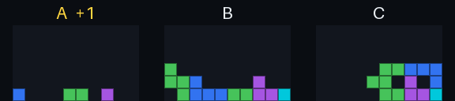

# 由本地模型来玩的俄罗斯方块

四个 Qwen 模型通过 `POST /v1/systemone` 玩完整的俄罗斯方块。规则交给代码：列出所有合法走法、模拟结果、按下按键。每一步都由模型选择，**每两个方块只用 1 个输出 token**。

**[在浏览器中试玩 →](https://hand-in.github.io/openjev-multimodal/demos/tetris/web/)** &nbsp; [完整测试报告](https://hand-in.github.io/openjev-multimodal/demos/tetris/report/) · [源码与录制数据](https://github.com/Hand-In/openjev-multimodal/tree/main/examples/tetris)

| 结果 | 实测 |
| --- | --- |
| 完成 10 次消除的对局 | **58 / 60** |
| Qwen3.8-27B 每次决策（精简提示） | 中位数 **0.73 秒** |
| 每局消除行数，Qwen3.8-27B | **38.2** · 随机选择 14.3 · 参考评估器 37.8 |
| 100 个方块后的最高分 | **15,262** · quality，精简，种子 202 |

## 观看每个模型对局

种子 101，从第一个方块播放到第 10 次消除。等待时间是每次调用实测的往返耗时。

<div class="tetris-videos">
<figure>
<video src="../../examples/tetris/report/videos/fast.mp4" poster="../../examples/tetris/report/videos/fast.jpg" controls muted playsinline preload="none"></video>
<figcaption><strong>fast · Qwen3.5-0.8B</strong>视觉 · 56 个方块达成 · 每次调用 0.14 秒</figcaption>
</figure>
<figure>
<video src="../../examples/tetris/report/videos/balanced.mp4" poster="../../examples/tetris/report/videos/balanced.jpg" controls muted playsinline preload="none"></video>
<figcaption><strong>balanced · Qwen3.5-4B</strong>视觉 · 30 个方块达成 · 每次调用 0.51 秒</figcaption>
</figure>
<figure>
<video src="../../examples/tetris/report/videos/quality.mp4" poster="../../examples/tetris/report/videos/quality.jpg" controls muted playsinline preload="none"></video>
<figcaption><strong>quality · Qwen3.6-35B-A3B</strong>视觉 · 32 个方块达成 · 每次调用 0.92 秒</figcaption>
</figure>
<figure>
<video src="../../examples/tetris/report/videos/max.mp4" poster="../../examples/tetris/report/videos/max.jpg" controls muted playsinline preload="none"></video>
<figcaption><strong>max · Qwen3.8-27B</strong>精简 · 32 个方块达成 · 每次调用 0.66 秒</figcaption>
</figure>
</div>

## 100 个方块后的结果

<div class="results">

| 档位 | 消除行数 · 视觉 | 消除行数 · 精简 | 调用 · 视觉 | 调用 · 精简 | 一致率 |
| --- | ---: | ---: | ---: | ---: | ---: |
| fast · Qwen3.5-0.8B | 26.6 | 17.4 | 0.15 秒 | 0.03 秒 | 42% |
| balanced · Qwen3.5-4B | 35.8 | 33.0 | 0.65 秒 | 0.12 秒 | 73% |
| quality · Qwen3.6-35B-A3B | 38.2 | 38.2 | 0.91 秒 | 0.14 秒 | 84% |
| max · Qwen3.8-27B | 38.4 | 38.2 | 4.08 秒 | 0.73 秒 | 85% |

</div>

每格 5 个种子，每局 100 个方块。一致率把视觉提示下的决策与参考评估器比较，参考评估器从不参与落子。[全部 60 局 →](https://hand-in.github.io/openjev-multimodal/demos/tetris/report/)

## 没有模型会怎样

在同样的剪枝方案上，随机选择 100 局中有 90 局堆满出局，平均消除 14.3 行；总选第一个方案为 16.0 行。代码缩小选择范围，由模型做出选择。

## 一次决策如何完成

1. **枚举。** 代码列出当前方块与下一个方块的所有落点，通常有 300–600 个两步方案。
2. **无权重剪枝。** 只有在每项实测事实上都不优于另一方案的走法才会被剔除，通常剩约 3 个。
3. **只问一次。** 一个 Choice 问题列出各方案及其事实：消除行数、新空洞、高度。视觉提示另附每个结果的字母小图。
4. **读取 1 个 token。** 答案是所有方案上的完整概率分布，代码按所选方案按键。

**精简提示**把规则作为不变的 state，问题中只放当前方块和简短的方案事实。API 会缓存 state，每次调用只需读取约 75–100 个新 token，这让稠密 27B 模型的决策进入一秒以内。



## 自己运行

```bash
uv run openjev serve                                  # 在 :8000 启动 balanced 档位
uv run python examples/tetris/serve.py                # 浏览器游戏：http://127.0.0.1:8765
uv run python examples/tetris/play.py bench --seeds 101,202,303,404,505 --modes vision,compact
```

测试环境：Apple M3 Max，llama.cpp（Metal）。每种配置 5 个种子，样本较小；耗时取决于机器与负载。

<style scoped>
.tetris-videos { display: grid; grid-template-columns: repeat(2, minmax(0, 1fr)); gap: 12px; margin: 20px 0 8px; }
.tetris-videos figure { margin: 0; border: 1px solid var(--vp-c-divider); border-radius: 10px; overflow: hidden; background: var(--vp-c-bg-soft); }
.tetris-videos video { display: block; width: 100%; aspect-ratio: 16 / 9; background: #101713; }
.tetris-videos figcaption { padding: 10px 12px 12px; font-size: 13px; line-height: 1.5; color: var(--vp-c-text-2); }
.tetris-videos figcaption strong { display: block; color: var(--vp-c-text-1); }
.results td, .results th { white-space: nowrap; }
@media (max-width: 760px) { .tetris-videos { grid-template-columns: 1fr; } }
</style>
